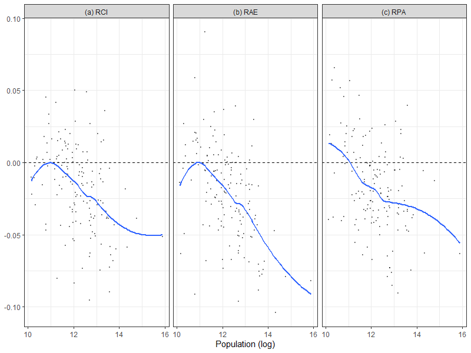

# Outputs for film

# Changed figure

# urban population growth

> if you could send whatever you think is appropriate. It doesn’t need to be a precise graph — the idea is more to convey a sense of the wider population movements out of urban centres after WW2 and then back again in the 80s/90s.

Potential source: [world bank](https://data.worldbank.org/indicator/SP.URB.TOTL.IN.ZS?end=2019&locations=GB&start=1960&view=chart)
